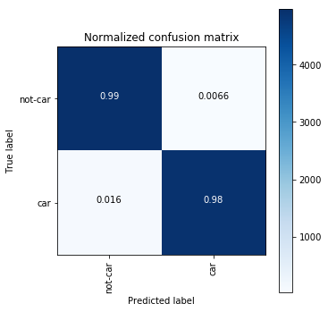
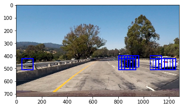
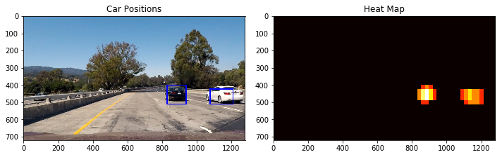
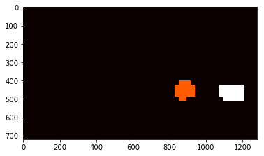
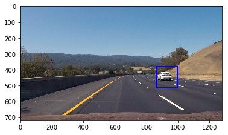
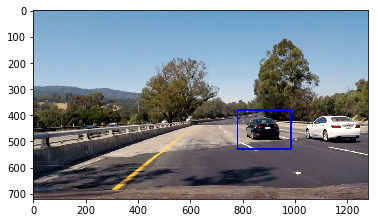
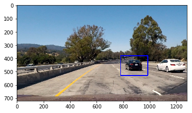
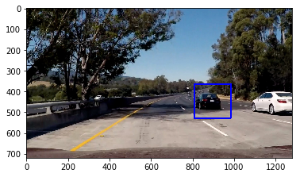
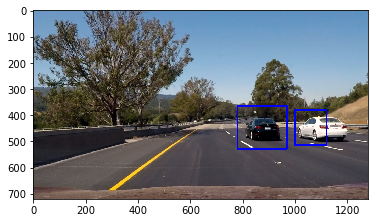
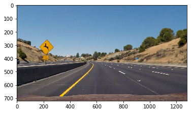

# Color classify


```python
import matplotlib.image as mpimg
import matplotlib.pyplot as plt
import numpy as np
import cv2
import glob
import time
from sklearn.svm import LinearSVC
from sklearn.preprocessing import StandardScaler
# NOTE: the next import is only valid 
# for scikit-learn version <= 0.17
# if you are using scikit-learn >= 0.18 then use this:
from sklearn.model_selection import train_test_split
# from sklearn.cross_validation import train_test_split

# Define a function to compute binned color features  
def bin_spatial(img, size=(32, 32)):
    # Use cv2.resize().ravel() to create the feature vector
    features = cv2.resize(img, size).ravel() 
    # print('bin_spatial size:',len(features))
    # Return the feature vector
    return features

# Define a function to compute color histogram features  
def color_hist(img, nbins=32, bins_range=(0, 256)):
    # Compute the histogram of the color channels separately
    channel1_hist = np.histogram(img[:,:,0], bins=nbins, range=bins_range)
    channel2_hist = np.histogram(img[:,:,1], bins=nbins, range=bins_range)
    channel3_hist = np.histogram(img[:,:,2], bins=nbins, range=bins_range)
    # Concatenate the histograms into a single feature vector
    hist_features = np.concatenate((channel1_hist[0], channel2_hist[0], channel3_hist[0]))
    # Return the individual histograms, bin_centers and feature vector 
    # print('color_hist size:',len(hist_features))
    return hist_features


# Read in car and non-car images

#for filename in glob.iglob('./non-vehicles/**/*.png', recursive=True):
#    pass #print(filename)

notcars = glob.glob('./non-vehicles/**/*.png', recursive=True)
print('notcars:',len(notcars))

cars = glob.glob('./vehicles/**/*.png', recursive=True)
print('cars:',len(cars))

```

    notcars: 8968
    cars: 8792


```python

```

# HOG classify


```python
import matplotlib.image as mpimg
import matplotlib.pyplot as plt
import numpy as np
import cv2
import glob
import time
from skimage.feature import hog
# NOTE: the next import is only valid for scikit-learn version <= 0.17
# for scikit-learn >= 0.18 use:
from sklearn.model_selection import train_test_split
#from sklearn.cross_validation import train_test_split

# Define a function to return HOG features and visualization
def get_hog_features(img, orient, pix_per_cell, cell_per_block, 
                        vis=False, feature_vec=True):
    # Call with two outputs if vis==True
    if vis == True:
        features, hog_image = hog(img, orientations=orient, pixels_per_cell=(pix_per_cell, pix_per_cell),
                                  cells_per_block=(cell_per_block, cell_per_block), transform_sqrt=True, 
                                  visualise=vis, feature_vector=feature_vec)
        return features, hog_image
    # Otherwise call with one output
    else:      
        features = hog(img, orientations=orient, pixels_per_cell=(pix_per_cell, pix_per_cell),
                       cells_per_block=(cell_per_block, cell_per_block), transform_sqrt=True, 
                       visualise=vis, feature_vector=feature_vec)
        # print('get_hog_features size:',len(features))
        return features

# Define a function to extract features from a list of images
# Have this function call bin_spatial() and color_hist()
def images_from_file(file, cspace):
    # Iterate through the list of images

    # Read in each one by one
    image = mpimg.imread(file)
    # apply color conversion if other than 'RGB'
    if cspace != 'RGB':
        if cspace == 'HSV':
            feature_image = cv2.cvtColor(image, cv2.COLOR_RGB2HSV)
        elif cspace == 'LUV':
            feature_image = cv2.cvtColor(image, cv2.COLOR_RGB2LUV)
        elif cspace == 'HLS':
            feature_image = cv2.cvtColor(image, cv2.COLOR_RGB2HLS)
        elif cspace == 'YUV':
            feature_image = cv2.cvtColor(image, cv2.COLOR_RGB2YUV)
        elif cspace == 'YCrCb':
            feature_image = cv2.cvtColor(image, cv2.COLOR_RGB2YCrCb)
    else: feature_image = np.copy(image)

    return feature_image


def extract_features(img, orient=9, 
                        pix_per_cell=8, cell_per_block=2, hog_channel=0, hist_bins=32):    
    # Apply bin_spatial() to get spatial color features
    spatial_size=(32, 32)
    feature_image = img

    spatial_features = bin_spatial(feature_image, size=spatial_size)
    hist_range=(0, 256)

    # Apply color_hist() also with a color space option now
    hist_features = color_hist(feature_image, nbins=hist_bins, bins_range=hist_range)

    # Call get_hog_features() with vis=False, feature_vec=True
    if hog_channel == 'ALL':
        hog_features = []
        for channel in range(feature_image.shape[2]):
            hog_feat = get_hog_features(feature_image[:,:,channel], orient, pix_per_cell, cell_per_block, 
                                vis=False, feature_vec=True)
            hog_features.append(hog_feat)
        hog_features = np.ravel(hog_features)        
    else:
        hog_features = get_hog_features(feature_image[:,:,hog_channel], orient, 
                    pix_per_cell, cell_per_block, vis=False, feature_vec=True)
        hog_features = np.ravel(hog_features)
        
    feature_vec = np.concatenate((spatial_features, hist_features,hog_features))
    return feature_vec
    
def extract_features_from_paths(img_file_paths, cspace='RGB', orient=9, 
                        pix_per_cell=8, cell_per_block=2, hog_channel=0, hist_bins=32):
    # Create a list to append feature vectors to
    features = []
    
    # Iterate through the list of images
    for file in img_file_paths:
        feature_image = images_from_file(file, cspace)
        feature_vec = extract_features(feature_image, orient=orient, 
                        pix_per_cell=pix_per_cell, cell_per_block=cell_per_block, 
                                       hog_channel=hog_channel, hist_bins=hist_bins)
            
        # Append the new feature vector to the features list
        features.append(feature_vec)
    # Return list of feature vectors
    return features

```

### Training the classifier
In this step we will use train the SVM classifier.
The training data is a combination of spatial pixel features, a histogram of the distibution of the pixel intensity and a histogram of oriented gradients.

An important step is to scale the training data in order to normalize the input to the classifier.
We will return a reference to the scaler in order to reuse it for the detection of vehicles in new images.


```python
from sklearn.svm import LinearSVC
from sklearn.svm import SVC
from sklearn.preprocessing import StandardScaler
from sklearn.tree import DecisionTreeClassifier


def train_and_evaluate(cars, notcars, colorspace, orient, pix_per_cell, cell_per_block, hog_channel, C, hist_bins):

    t=time.time()
    car_features = extract_features_from_paths(cars, cspace=colorspace, orient=orient, 
                            pix_per_cell=pix_per_cell, cell_per_block=cell_per_block, 
                            hog_channel=hog_channel, hist_bins=hist_bins)
    notcar_features = extract_features_from_paths(notcars, cspace=colorspace, orient=orient, 
                            pix_per_cell=pix_per_cell, cell_per_block=cell_per_block, 
                            hog_channel=hog_channel, hist_bins=hist_bins)
    t2 = time.time()
    print(round(t2-t, 2), 'Seconds to extract HOG features...')
    # Create an array stack of feature vectors
    # print('len(car_features)',len(car_features))
    # print('car_features[0].shape',car_features[0].shape)
    X = np.vstack((car_features, notcar_features)).astype(np.float64)
    print('X.shape',X.shape)                        
    # Fit a per-column scaler
    X_scaler = StandardScaler().fit(X)
    # Apply the scaler to X
    scaled_X = X_scaler.transform(X)
    
    # Define the labels vector
    y = np.hstack((np.ones(len(car_features)), np.zeros(len(notcar_features))))
    #print('min X', np.min(X), 'max X', np.max(X))
    #print('mean X', np.mean(X), 'std X', np.std(X))

    # Split up data into randomized training and test sets
    rand_state = 42 #np.random.randint(0, 100)
    X_train, X_test, y_train, y_test = train_test_split(
        scaled_X, y, test_size=0.2, random_state=rand_state)

    print('Using:',orient,'orientations',pix_per_cell,
        'pixels per cell and', cell_per_block,'cells per block')
    print('Feature vector length:', len(X_train[0]))
    # Use a linear SVC 
    # svc = SVC(C=C)
    # svc = DecisionTreeClassifier()
    svc = LinearSVC(C=C)
    # Check the training time for the SVC
    t=time.time()
    svc.fit(X_train, y_train)
    t2 = time.time()
    print(round(t2-t, 2), 'Seconds to train SVC...')
    # Check the score of the SVC
    score = round(svc.score(X_train, y_train), 4)
    print('Train Accuracy of SVC = ', score)
    score = round(svc.score(X_test, y_test), 4)
    print('Test Accuracy of SVC = ', score)
    # Check the prediction time for a single sample
    t=time.time()
    n_predict = 10
    print('My SVC predicts:      ', svc.predict(X_test[0:n_predict]))
    print('For these',n_predict, 'labels: ', y_test[0:n_predict])
    t2 = time.time()
    print(round(t2-t, 5), 'Seconds to predict', n_predict,'labels with SVC')
    return score, svc, X_scaler
```

Now that we have create some helper functions to train the classifier, we will limit the training dataset to 4000 randomly selected cars and 4000 randomly selected non cars images.


```python
sample_size = 4000
selected_samples = np.random.choice(min(len(cars),len(notcars)),sample_size)

cars_sample = [cars[i] for i in selected_samples]
notcars_sample = [notcars[i] for i in selected_samples]
print('sample_size: ', len(cars_sample) + len(notcars_sample) )

### The following part of will perform a grid search on the features 
# calculation of the hyper parameters.
colorspace = 'YCrCb' # Can be RGB, HSV, LUV, HLS, YUV, YCrCb
orients = [9]
pix_per_cells = [4,16]
cell_per_blocks = [2]
hog_channel = 'ALL' # Can be 0, 1, 2, or "ALL"
C_list = [1]
hist_bins_list = [16,20,]

param_gen=[(orient,pix_per_cell, cell_per_block, C, hist_bins) for orient in orients for pix_per_cell in pix_per_cells
             for cell_per_block in cell_per_blocks for C in C_list for hist_bins in hist_bins_list]

res = dict()
res['score'] = list()
res['params'] = list()
res['model'] = list() 
res['X_scaler'] = list()

# Grid search for best hyperparameters
for (orient,pix_per_cell, cell_per_block, C, hist_bins) in param_gen:
    try:
        print('orient:', orient, ' pix_per_cell:',pix_per_cell, ' cell_per_block:', cell_per_block,
              'C:', C, ' hist_bins:', hist_bins)
        score, svc, X_scaler = train_and_evaluate(cars_sample, notcars_sample, colorspace, orient, pix_per_cell,
                                   cell_per_block, hog_channel, C, hist_bins)
        res['score'].append(score)
        res['params'].append((orient,pix_per_cell, cell_per_block,C, hist_bins,))
        res['model'].append(svc)
        res['X_scaler'].append(X_scaler)
        
    #except Exception as ex:
    #    print('Exception: ', str(ex))
    finally:
        print('End of trial\n\n')
    
print('End computation')
```

    sample_size:  4000 len(cars_sample):  4000
    orient: 9  pix_per_cell: 4  cell_per_block: 2 C: 1  hist_bins: 16
    95.82 Seconds to extract HOG features...
    X.shape (8000, 27420)
    Using: 9 orientations 4 pixels per cell and 2 cells per block
    Feature vector length: 27420
    4.49 Seconds to train SVC...
    Train Accuracy of SVC =  1.0
    Test Accuracy of SVC =  0.9888
    My SVC predicts:       [ 1.  1.  1.  1.  0.  1.  1.  1.  0.  1.]
    For these 10 labels:  [ 1.  1.  1.  1.  0.  1.  1.  1.  0.  1.]
    0.00181 Seconds to predict 10 labels with SVC
    End of trial
    
    
    orient: 9  pix_per_cell: 4  cell_per_block: 2 C: 1  hist_bins: 20
    55.44 Seconds to extract HOG features...
    X.shape (8000, 27432)
    Using: 9 orientations 4 pixels per cell and 2 cells per block
    Feature vector length: 27432
    4.75 Seconds to train SVC...
    Train Accuracy of SVC =  1.0
    Test Accuracy of SVC =  0.9888
    My SVC predicts:       [ 1.  1.  1.  1.  0.  1.  1.  1.  0.  1.]
    For these 10 labels:  [ 1.  1.  1.  1.  0.  1.  1.  1.  0.  1.]
    0.00179 Seconds to predict 10 labels with SVC
    End of trial
    
    
    orient: 9  pix_per_cell: 16  cell_per_block: 2 C: 1  hist_bins: 16
    19.49 Seconds to extract HOG features...
    X.shape (8000, 4092)
    Using: 9 orientations 16 pixels per cell and 2 cells per block
    Feature vector length: 4092
    5.57 Seconds to train SVC...
    Train Accuracy of SVC =  1.0
    Test Accuracy of SVC =  0.99
    My SVC predicts:       [ 1.  1.  1.  1.  0.  1.  1.  1.  0.  1.]
    For these 10 labels:  [ 1.  1.  1.  1.  0.  1.  1.  1.  0.  1.]
    0.00174 Seconds to predict 10 labels with SVC
    End of trial
    
    
    orient: 9  pix_per_cell: 16  cell_per_block: 2 C: 1  hist_bins: 20
    19.02 Seconds to extract HOG features...
    X.shape (8000, 4104)
    Using: 9 orientations 16 pixels per cell and 2 cells per block
    Feature vector length: 4104
    5.53 Seconds to train SVC...
    Train Accuracy of SVC =  1.0
    Test Accuracy of SVC =  0.99
    My SVC predicts:       [ 1.  1.  1.  1.  0.  1.  1.  1.  0.  1.]
    For these 10 labels:  [ 1.  1.  1.  1.  0.  1.  1.  1.  0.  1.]
    0.00161 Seconds to predict 10 labels with SVC
    End of trial
    
    
    End computation


```python
scores = np.array(res['score'])
print(len(res['score']))
best_score_idx = np.argmax(res['score'])
print(np.max(scores, axis=0))
print('Best score is:', scores[best_score_idx], ' for parameters (orient,pix_per_cell, cell_per_block, C, hist_bins,) :',
     res['params'][best_score_idx])

#Best score is: 0.875  for paramters (orient,pix_per_cell, cell_per_block, C, hist_bins,) : (9, 4, 2, 1, 16)
print('Saving best performing model on validation data set.')
import pickle

pickle.dump(res['model'][best_score_idx], open('saved_svm_model.p', 'wb'))
pickle.dump(res['params'][best_score_idx], open('features_calc_params.p', 'wb'))
pickle.dump(res['X_scaler'][best_score_idx], open('features_scale.p', 'wb'))

```

    4
    0.99
    Best score is: 0.99  for parameters (orient,pix_per_cell, cell_per_block, C, hist_bins,) : (9, 16, 2, 1, 16)
    Saving best performing model on validation data set.


# Evaluate the performance of the classifier

### Simple evaluation

We will first perform a simple evaluation of the classifier on 10 examples


```python
### Reload parameters saved from the disk.
colorspace = 'YCrCb'
orient,pix_per_cell, cell_per_block, C, hist_bins  = pickle.load(open('features_calc_params.p', 'rb'))
X_scaler  = pickle.load(open('features_scale.p', 'rb'))
svc = pickle.load(open('saved_svm_model.p', 'rb'))

sample_size = 5
selected_samples = np.random.choice(min(len(cars),len(notcars)),sample_size)

cars_sample = [cars[i] for i in selected_samples]
notcars_sample = [notcars[i] for i in selected_samples]
print('example_samples: ', len(example_samples) )

# Concatenate the list of 5 cars with the list of 5 non-cars
example_samples = cars_sample + notcars_sample

some_cars = extract_features_from_paths(example_samples, cspace=colorspace, orient=orient, 
                            pix_per_cell=pix_per_cell, cell_per_block=cell_per_block, 
                            hog_channel=hog_channel, hist_bins=hist_bins)
print(len(some_cars))

some_cars = np.vstack((some_cars)).astype(np.float64)

scaled_some_cars = X_scaler.transform(some_cars)

y_pred = svc.predict(scaled_some_cars)
print(y_pred)
```

    example_samples:  10
    10
    [ 1.  1.  1.  1.  1.  0.  0.  0.  0.  0.]


### Confusion Matrix

Calculate Confusion Matrix on 10000 randomly selected examples


```python
sample_size = 5000
selected_samples = np.random.choice(min(len(cars),len(notcars)),sample_size)

cars_sample = [cars[i] for i in selected_samples]
notcars_sample = [notcars[i] for i in selected_samples]

# Concatenate the list of 5000 cars with the list of 5000 non-cars
example_samples = cars_sample + notcars_sample

# Generating labels
y_test = np.zeros(sample_size*2)
y_test[0:y_test.shape[0]//2] = 1 # First halfs are cars and second half are non-cars

print('example_samples: ', len(example_samples) )

```

    example_samples:  10000


```python
import itertools
import numpy as np
import matplotlib.pyplot as plt
from sklearn.metrics import confusion_matrix

def plot_confusion_matrix(cm, classes,
                          normalize=False,
                          title='Confusion matrix',
                          cmap=plt.cm.Blues):
    """
    This function prints and plots the confusion matrix.
    Normalization can be applied by setting `normalize=True`.
    """
    
    if normalize:
        cm = cm.astype('float') / cm.sum(axis=1)[:, np.newaxis]
        print("Normalized confusion matrix")
    else:
        print('Confusion matrix, without normalization')
        
    plt.imshow(cm, interpolation='nearest', cmap=cmap)
    plt.title(title)
    tick_marks = np.arange(len(classes))
    plt.xticks(tick_marks, classes, rotation=90)
    plt.yticks(tick_marks, classes)


    print(cm)

    thresh = cm.max() / 2.
    for i, j in itertools.product(range(cm.shape[0]), range(cm.shape[1])):
        plt.text(j, i, round(cm[i, j]*100)/100,
             horizontalalignment="center",
             color="white" if cm[i, j] > thresh else "black")


    plt.tight_layout()
    plt.ylabel('True label')
    plt.xlabel('Predicted label')
    

# This function plots the confusion matrix
# The original version of this implementation can be found on
# this page http://scikit-learn.org/stable/auto_examples/model_selection/plot_confusion_matrix.html#sphx-glr-auto-examples-model-selection-plot-confusion-matrix-py
 
import itertools
import numpy as np
import matplotlib.pyplot as plt
from sklearn.metrics import confusion_matrix

def plot_confusion_matrix(cm, classes,
                          normalize=False,
                          title='Confusion matrix',
                          cmap=plt.cm.Blues):
    """
    This function prints and plots the confusion matrix.
    Normalization can be applied by setting `normalize=True`.
    """
    plt.imshow(cm, interpolation='nearest', cmap=cmap)
    plt.title(title)
    plt.colorbar()
    tick_marks = np.arange(len(classes))
    plt.xticks(tick_marks, classes, rotation=90)
    plt.yticks(tick_marks, classes)

    if normalize:
        cm = cm.astype('float') / cm.sum(axis=1)[:, np.newaxis]
        print("Normalized confusion matrix")
    else:
        print('Confusion matrix, without normalization')

    print(cm)

    thresh = cm.max() / 2.
    for i, j in itertools.product(range(cm.shape[0]), range(cm.shape[1])):
        if cm[i, j]<1:
            plt.text(j, i, '{:.2}'.format(cm[i, j]),
                 horizontalalignment="center",
                 color="white" if cm[i, j] > thresh else "black")
        else:
            plt.text(j, i, cm[i, j],
                 horizontalalignment="center",
                 color="white" if cm[i, j] > thresh else "black")


    plt.tight_layout()
    plt.ylabel('True label')
    plt.xlabel('Predicted label')
    

```


```python
# Evaluate function on 10000 examples
some_cars = extract_features_from_paths(example_samples, cspace=colorspace, orient=orient, 
                            pix_per_cell=pix_per_cell, cell_per_block=cell_per_block, 
                            hog_channel=hog_channel, hist_bins=hist_bins)

some_cars = np.vstack((some_cars)).astype(np.float64)

scaled_some_cars = X_scaler.transform(some_cars)

y_pred = svc.predict(scaled_some_cars)


# Compute confusion matrix
cnf_matrix = confusion_matrix(y_test, y_pred)
np.set_printoptions(precision=2)


```

The number of false positives is fairly low. However a concerning aspect is that the number of false negatives is greater than 1%. This would not be suitable in a production car.  


```python
# Plot normalized confusion matrix
plt.figure(figsize=(5,5))
plot_confusion_matrix(cnf_matrix, classes=['not-car','car'], normalize=True,
                      title='Normalized confusion matrix')

plt.show()
```

    Normalized confusion matrix
    [[ 0.99  0.01]
     [ 0.02  0.98]]





# Hog Sub-sampling Window Search
This is a more efficient method than a sliding window technique.

This method allows us to execute the HOG algorithm features just once per frame.


```python
import matplotlib.image as mpimg
import matplotlib.pyplot as plt
import numpy as np
import pickle
import cv2

spatial_size=(32, 32)

img = mpimg.imread('test_images/test1.jpg')

# Define a single function that can extract features using hog sub-sampling and make predictions
def find_cars(img, ystart, ystop, scale, svc, X_scaler, orient, pix_per_cell, cell_per_block, spatial_size, hist_bins):
    
    draw_img = np.copy(img)
    img = img.astype(np.float32)/255
    
    img_tosearch = img[ystart:ystop,:,:]
    ctrans_tosearch = cv2.cvtColor(img_tosearch, cv2.COLOR_RGB2YCrCb)
    
    if scale != 1:
        imshape = ctrans_tosearch.shape
        ctrans_tosearch = cv2.resize(ctrans_tosearch, (np.int(imshape[1]/scale), np.int(imshape[0]/scale)))
        
    ch1 = ctrans_tosearch[:,:,0]
    ch2 = ctrans_tosearch[:,:,1]
    ch3 = ctrans_tosearch[:,:,2]

    # Define blocks and steps as above
    nxblocks = (ch1.shape[1] // pix_per_cell)-1
    nyblocks = (ch1.shape[0] // pix_per_cell)-1 
    nfeat_per_block = orient*cell_per_block**2
    # 64 was the orginal sampling rate, with 8 cells and 8 pix per cell
    window = 64
    nblocks_per_window = (window // pix_per_cell)-1 
    cells_per_step = 1  # Instead of overlap, define how many cells to step
    nxsteps = (nxblocks - nblocks_per_window) // cells_per_step
    nysteps = (nyblocks - nblocks_per_window) // cells_per_step
    
    # Compute individual channel HOG features for the entire image
    hog1 = get_hog_features(ch1, orient, pix_per_cell, cell_per_block, feature_vec=False)
    hog2 = get_hog_features(ch2, orient, pix_per_cell, cell_per_block, feature_vec=False)
    hog3 = get_hog_features(ch3, orient, pix_per_cell, cell_per_block, feature_vec=False)
    
    bbox_list = []
    
    for xb in range(nxsteps):
        for yb in range(nysteps):
            ypos = yb*cells_per_step
            xpos = xb*cells_per_step
            # Extract HOG for this patch
            hog_feat1 = hog1[ypos:ypos+nblocks_per_window, xpos:xpos+nblocks_per_window].ravel() 
            hog_feat2 = hog2[ypos:ypos+nblocks_per_window, xpos:xpos+nblocks_per_window].ravel() 
            hog_feat3 = hog3[ypos:ypos+nblocks_per_window, xpos:xpos+nblocks_per_window].ravel() 
            hog_features = np.hstack((hog_feat1, hog_feat2, hog_feat3)).ravel()
            # print('hog_features size', len(hog_features))
            xleft = xpos*pix_per_cell
            ytop = ypos*pix_per_cell

            # Extract the image patch
            subimg = cv2.resize(ctrans_tosearch[ytop:ytop+window, xleft:xleft+window], (32,32))
          
            # Get color features
            spatial_features = bin_spatial(subimg, size=spatial_size).ravel()
            hist_features = color_hist(subimg, nbins=hist_bins).ravel()
            # Scale features and make a prediction
            feature_vec = np.concatenate((spatial_features, hist_features,hog_features)).ravel()
            test_features = X_scaler.transform(feature_vec.reshape(1, -1))    
            test_prediction = svc.predict(test_features)
            
            if test_prediction == 1:
                xbox_left = np.int(xleft*scale)
                ytop_draw = np.int(ytop*scale)
                win_draw = np.int(window*scale)
                bbox_list.append(((xbox_left, ytop_draw+ystart), (xbox_left+win_draw,ytop_draw+win_draw+ystart),))
                cv2.rectangle(draw_img,(xbox_left, ytop_draw+ystart),(xbox_left+win_draw,ytop_draw+win_draw+ystart),(0,0,255),6) 
                
    return draw_img, bbox_list
    
ystart = 400
ystop = 656
scale = 1.4
    
out_img, bbox_list = find_cars(img, ystart, ystop, scale, svc, X_scaler, orient, pix_per_cell, cell_per_block, spatial_size, hist_bins)

plt.imshow(out_img)
plt.show()
```





```python

```

## Heatmap


```python
import matplotlib.image as mpimg
import matplotlib.pyplot as plt
import numpy as np
import pickle
import cv2
from scipy.ndimage.measurements import label

# Read in a pickle file with bboxes saved
# Each item in the "all_bboxes" list will contain a 
# list of boxes for one of the images shown above
box_list = bbox_list 

# Read in image similar to one shown above 
image = img
heat = np.zeros_like(image[:,:,0]).astype(np.float)

def add_heat(heatmap, bbox_list):
    # Iterate through list of bboxes
    for box in bbox_list:
        # Add += 1 for all pixels inside each bbox
        # Assuming each "box" takes the form ((x1, y1), (x2, y2))
        heatmap[box[0][1]:box[1][1], box[0][0]:box[1][0]] += 1

    # Return updated heatmap
    return heatmap# Iterate through list of bboxes
    
def apply_threshold(heatmap, threshold):
    # Zero out pixels below the threshold
    heatmap[heatmap <= threshold] = 0
    # Return thresholded map
    return heatmap

def get_labeled_bboxes(labels):
    # Iterate through all detected cars
    bbox_list = []
    for car_number in range(1, labels[1]+1):
        # Find pixels with each car_number label value
        nonzero = (labels[0] == car_number).nonzero()
        # Identify x and y values of those pixels
        nonzeroy = np.array(nonzero[0])
        nonzerox = np.array(nonzero[1])
        # Define a bounding box based on min/max x and y
        bbox = ((np.min(nonzerox), np.min(nonzeroy)), (np.max(nonzerox), np.max(nonzeroy)))
        # Draw the box on the image
        bbox_list.append(bbox)
    return bbox_list

def draw_labeled_bboxes(img, bbox_list):
    for bbox in bbox_list:
        cv2.rectangle(img, bbox[0], bbox[1], (0,0,255), 6)
    # Return the image
    return img
    
# Add heat to each box in box list
heat = add_heat(heat,box_list)
    
# Apply threshold to help remove false positives
heat = apply_threshold(heat, 2)

# Visualize the heatmap when displaying    
heatmap = np.clip(heat, 0, 255)

# Find final boxes from heatmap using label function
labels = label(heatmap)
#draw_img = draw_labeled_bboxes(np.copy(image), labels)

bbox_list = get_labeled_bboxes(labels)
draw_img = draw_labeled_bboxes(np.copy(image), bbox_list)

fig = plt.figure(figsize=(10,10))
plt.subplot(121)
plt.imshow(draw_img)
plt.title('Car Positions')
plt.subplot(122)
plt.imshow(heatmap, cmap='hot')
plt.title('Heat Map')
fig.tight_layout()
plt.show()

print(labels[1], 'cars found')
plt.imshow(labels[0], cmap='hot')
plt.show()


```





    2 cars found





## Video processing callback. 
This function chooses which lane finding algorithm to use as a function of the estimated quality of the algorithm.
The function choose between lane_sliding_window and poly_envelope_lane_search.


### Avoiding false positives,

In order to avoid false positives we will use a combination of labeled box thresholding, spatial filtering and temporal filtering.
Spatial filtering : I used gaussian filtering to group dis-connected boxes around a car together 
Temporal filtering : I used a FIR filter on successive frames
Labeled box thresholding: Only the strongest cell candidates should be retained.


```python
# In order to stabilize 
class Filter:
    """
    
    This class is a static class. 
    Just one instance of the parameters is needed.
    """
    value = dict()
    
    def __init__(self):
        self.value = dict()
        self.z = None
        self.coeffs = np.array([0.2, 0.3, 0.5])
        self.index = 0
        self.bbox_list_z = list()
    
    def apply_coef_heat(self, heatblur):
        if self.z is None:
             self.z = np.zeros(shape=(heatblur.shape[0], heatblur.shape[1],
                                               self.coeffs.shape[0]))
        self.z[:,:, self.index] = heatblur
        heat = np.zeros_like(heatblur)
        
        for i, roll in zip(range(self.coeffs.shape[0]), range(self.index, self.index+self.coeffs.shape[0], 1)):
            roll_i = roll if roll < self.coeffs.shape[0] else roll - self.coeffs.shape[0]
            #print('(i, roll, roll_i):',(i, roll, roll_i))
            heat  = heat + self.z[:,:, roll_i] * self.coeffs[i]
        
        self.index = self.index + 1 if self.index < self.coeffs.shape[0]-1 else 0
        self.z[:, :, self.index] = heat
        
        return heat

            
            
    def get_z(self):
        return self.z

```


```python
# Define callback for processing image

spatial_size=(32, 32)
ystart = 400
ystop = 656
scale = .85

def process_image(image):
    heat = np.zeros_like(image[:,:,0]).astype(np.float)

    out_img, bbox_list = find_cars(image, ystart, ystop, scale, svc, X_scaler, orient, pix_per_cell, cell_per_block, spatial_size, hist_bins)

    # Add heat to each box in box list
    heat = add_heat(heat,bbox_list)

    # Apply threshold to help remove false positives
    heat = apply_threshold(heat, 4)

    # Visualize the heatmap when displaying    
    heatmap = np.clip(heat, 0, 255).astype(np.float32)
    heatblur = cv2.GaussianBlur(heatmap,(0,0),12)
    filteredheat = filt.apply_coef_heat(heatblur)
    
    # Find final boxes from heatmap using label function
    labels = label(filteredheat)
    bbox_list = get_labeled_bboxes(labels)
    #filt.apply_coef_bbox(bbox_list)
    draw_img = draw_labeled_bboxes(np.copy(image), bbox_list)
    
    return draw_img
    
```

# Testing pipeline on a few images


```python

imgs_paths = glob.glob('./test_images/*.jpg', recursive=True)
for im_path in imgs_paths:
    filt = Filter()
    image = mpimg.imread(im_path)
    im_out = process_image(image)
    plt.imshow(im_out)
    plt.show()
```

















```python

filt = Filter()
print(filt.get_z())

from moviepy.editor import VideoFileClip
clip = VideoFileClip("project_video.mp4")
plt.imshow(image)
plt.show()

#clip = VideoFileClip("./test_video.mp4")
video_output = './output_images/project_video.mp4'

processed_clip = clip.fl_image(process_image)

%time processed_clip.write_videofile(video_output, audio=False)

```

    None





    [MoviePy] >>>> Building video ./output_images/project_video.mp4
    [MoviePy] Writing video ./output_images/project_video.mp4


    100%|█████████▉| 1260/1261 [12:22<00:00,  1.74it/s]


    [MoviePy] Done.
    [MoviePy] >>>> Video ready: ./output_images/project_video.mp4 
    
    CPU times: user 16min 37s, sys: 3.77 s, total: 16min 40s
    Wall time: 12min 23s


```python

```


```python

```
